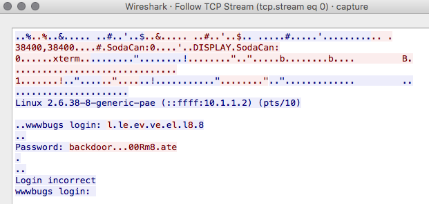

# Level08

## Task

>World readable files strike again. Check what that user was up to, and use it to log into flag08 account.

>To do this level, log in as the level08 account with the password level08. Files for this level can be found in /home/flag08.

## Solution

there is a pcap in the home directory, scp'ing this over and opening in wireshark gives us the below

```
scp level08@192.168.1.10:/home/flag08/capture.pcap .
level08@192.168.1.10's password:
capture.pcap                                                                         100% 8302     8.1KB/s   00:00
```



so the password looks to be `backdoor...00Rm8.ate` however the `.` are represented by `\x7f` so the password actually is `backd00Rmate`

```
level08@nebula:/home/flag08$ su flag08
Password:backd00Rmate
```

```
sh-4.2$ whoami ; getflag
flag08
You have successfully executed getflag on a target account
```
